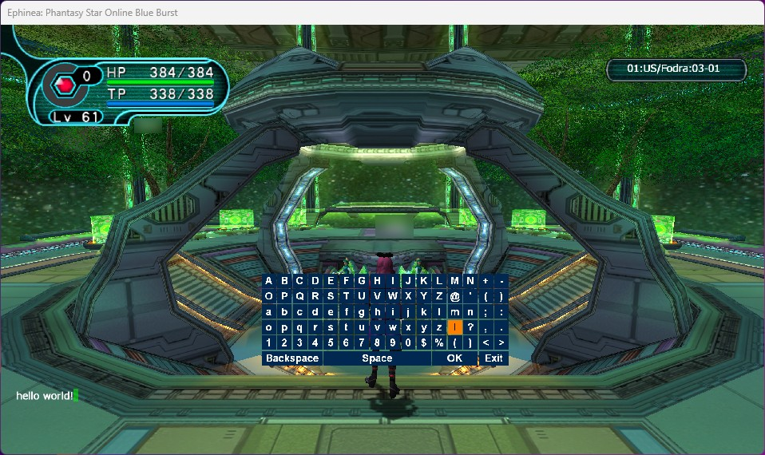
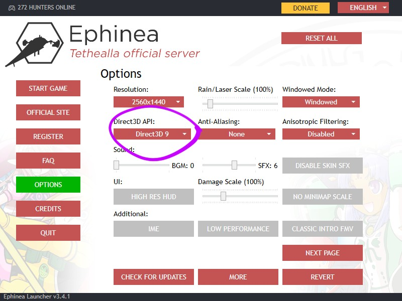
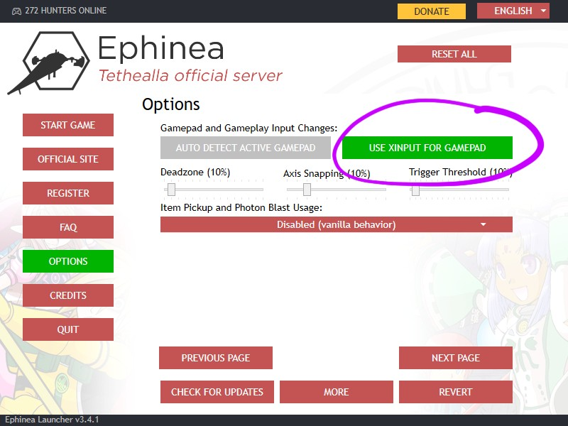

# About
This mod lets you type in text chat and in text fields using a controller in Phantasy Star Online Blue Burst (PSOBB) on PC by adding a virtual onscreen keyboard.



## Compatibility
To use this mod, you will need the following:

1. An Xbox controller. Alternatively, you can launch the game through Steam and use Steam Input. 

2. "Direct3D 9" selected in the launcher settings:


3. "Use XInput for gamepad" enabled in the launcher settings:


## Installation
1. Download the latest mod files from [Releases](https://github.com/init-ok/pso_bb_virtual_keyboard/releases/).
2. Extract them to the game directory, e.g. `C:\Users\my_username\EphineaPSO`.
3. Start the game and press the select button on your Xbox controller to open the keyboard.

## Controls
Select button (default setting): opens/closes the virtual keyboard.  

The following controls can be used when the keyboard is open:  
D-pad: moves the keyboard cursor.  
A button: presses the selected button.  
Right analog stick: moves the onscreen keyboard.  

## Configuration
A `config.ini` file is created in the `mod` directory the first time the game is launched with the mod installed. You can use this file to configure the settings.

### Changing the toggle keyboard binding
You can change the keybinding that's used to toggle the keyboard by modifying the toggle_keyboard_combo variable in the config file, for example, changing it to toggle when left shoulder and x are pressed at the same time:
```
toggle_keyboard_combo = left_shoulder + x
```

The possible buttons names you can specify here are case-insensitive and named according to the XInput API:
```
a, b, x, y, start, back, left_thumb, right_thumb, left_shoulder, right_shoulder, dpad_up, dpad_down, dpad_left, dpad_right
```

### Changing the keyboard size
You can change the keyboard size by modifying the `virtual_keyboard_scale` variable in config file, for example, changing it to 2:
```
virtual_keyboard_scale = 2
```

## Troubleshooting
The mod and mod loader write logs to a `logs.txt` file that's stored in the `mod` folder. Please share this file (if applicable) when filing GitHub issues.

## Development
After building a project within the Visual Studio solution, VS will copy the associated built files to the game directory, which is assumed to be `C:\Users\<username>\EphineaPSO`.
